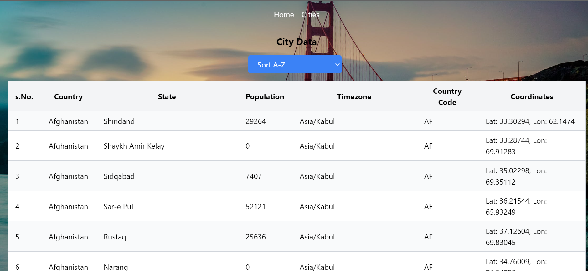
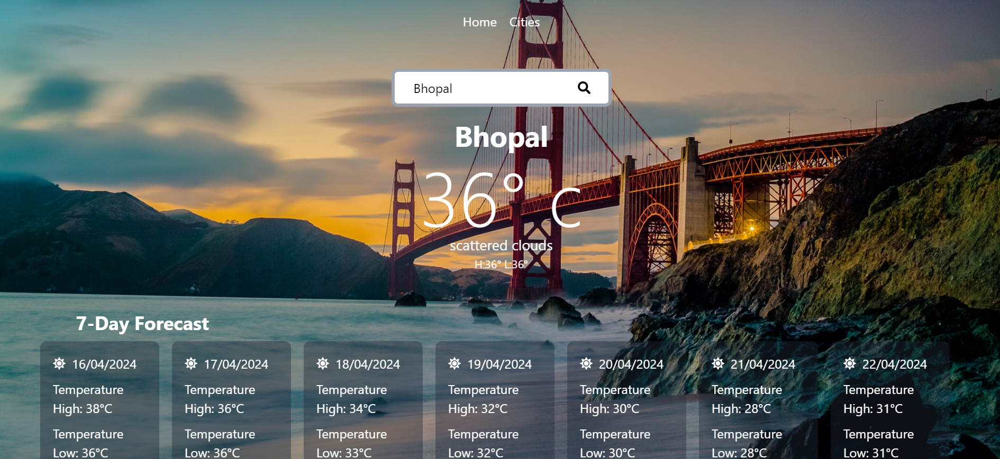

# Project Title

This project is a part of the assignment given by Stamurai. Below are the details of the assignment and the completion.

## Assignment Details

- **Organization:** Stamurai
- **Task:** Build a web application to display weather information for cities using data from [OpenWeatherMap API](https://openweathermap.org/api) and city information from [OpenDataSoft API](https://public.opendatasoft.com/api/explore/v2.1/catalog/datasets/geonames-all-cities-with-a-population-1000/records?limit=100).
- **Completion Date:** [Date]

## About the Project

This project aims to display weather information for various cities. It fetches city data from the OpenDataSoft API and weather data from the OpenWeatherMap API. The web application allows users to search for cities and view their weather details.

## Completion Summary

- Implemented fetching city data from the OpenDataSoft API.
- Integrated fetching weather data for cities from the OpenWeatherMap API.
- Displayed weather information for cities on the web application.
- Styled the application using Tailwind CSS.
- Added navigation functionality using React Router.

## Images

Here are some screenshots from the project:

_Caption for screenshot 1_

_Caption for screenshot 2_

## Getting Started

To run the project locally, follow these steps:

1. Clone the repository.
2. Install dependencies using `npm install`.
3. Start the development server using `npm start`.

## Technologies Used

- React.js
- Tailwind CSS
- React Router
- Axios

## Credits

- **OpenDataSoft API:** [Link](https://public.opendatasoft.com/api/explore/v2.1/catalog/datasets/geonames-all-cities-with-a-population-1000/records?limit=100)
- **OpenWeatherMap API:** [Link](https://openweathermap.org/api)

## License

This project is licensed under the [MIT License](LICENSE).
